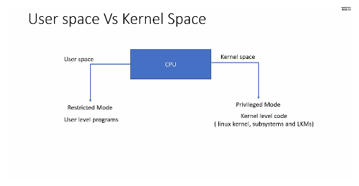
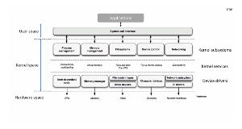
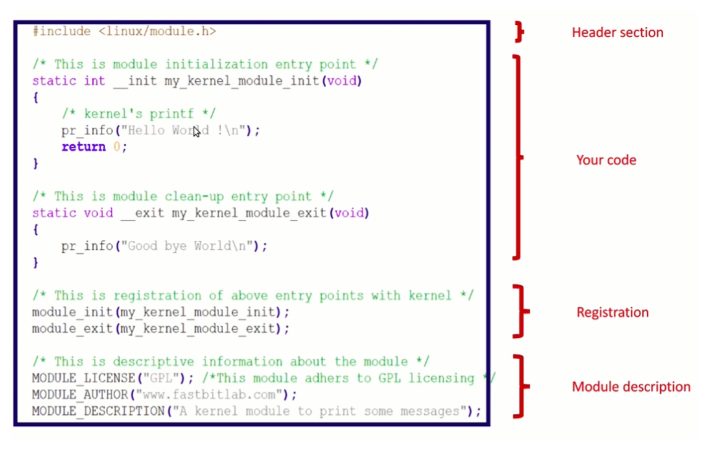

# Linux Kernel and User Space Overview



Kernel space code runs on the CPU in privileged mode, allowing access to restricted resources such as memory, peripherals, and processor instructions. On the other hand, user space applications run in non-privileged mode and cannot access these restricted resources directly. They interact with the kernel through system calls.



When user space programs need to access restricted resources, they request the kernel's assistance through system calls. System call handlers, kernel-level code, fulfill these requests in privileged mode.

## Linux Kernel Modules (LKMs)

Linux supports dynamic insertion and removal of code from the kernel, referred to as kernel modules or LKMs. LKMs extend the functionality of the kernel by introducing new features such as security, device drivers, file system drivers, and system calls. There are two types of LKMs: static and dynamic.

- **Static (y)**: Built into the final kernel image, cannot be unloaded, occupies memory permanently.
- **Dynamic (m)**: Compiled separately to produce `.ko` files, can be dynamically loaded and unloaded from the kernel.

## Linux Kernel Module Syntax

Every kernel module includes the `linux/module.h` header file, which contains necessary macros and definitions. Kernel modules follow specific syntax and rules to execute within kernel space.



### Module Initialization and Cleanup

Kernel modules have initialization and cleanup functions:
```c
static int __init helloworld_init(void) {
   pr_info("Hello world\n");
   return 0;
}

static void __exit helloworld_cleanup(void) {
  pr_info("Goodbye world\n");
}
__init: Specifies the initialization entry point, called during module insertion.
__exit: Specifies the cleanup entry point, called during module removal.
Module Entry Points Registration
These macros register the module's initialization and cleanup functions with the kernel:

c
Copy code
module_init(init_func);
module_exit(exit_func);
Building a Kernel Module
Kernel modules can be built statically linked against the kernel image or dynamically loadable. To build an out-of-tree kernel module:

Ensure you have prebuilt kernel source available.
Use kbuild to compile the module with the correct kernel configuration.
Create a local Makefile to define module compilation settings.
Use make to build the module:
sh
Copy code
make -C <path to linux kernel tree> M=<path to your module> [target]

