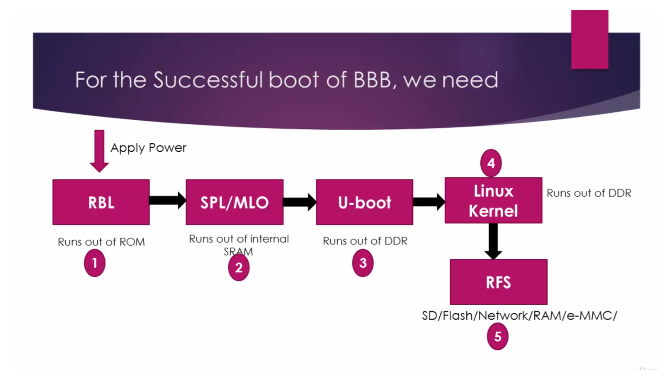
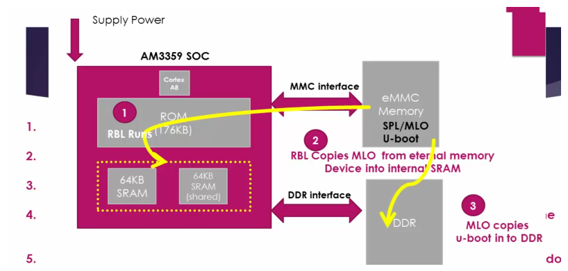
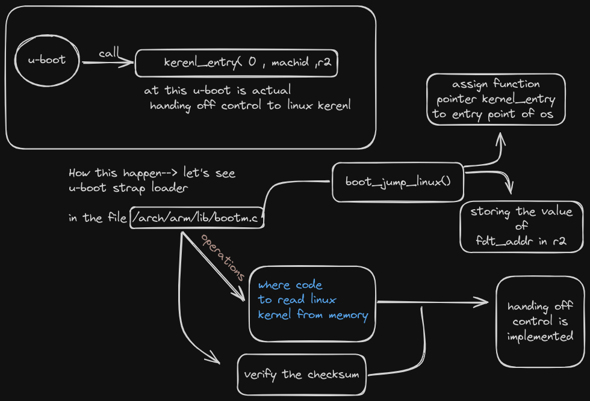
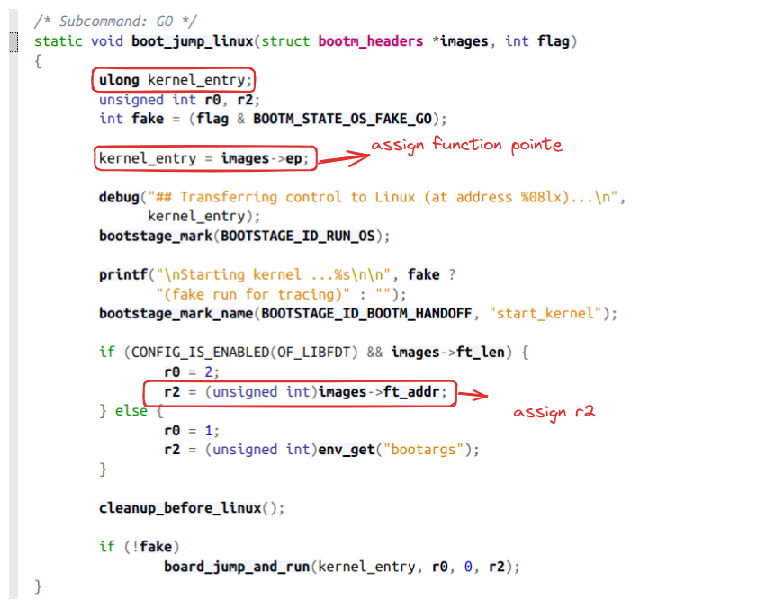
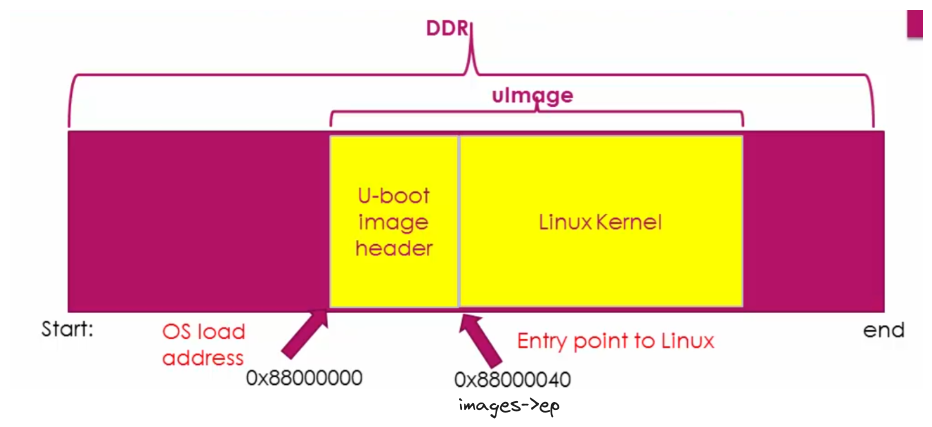
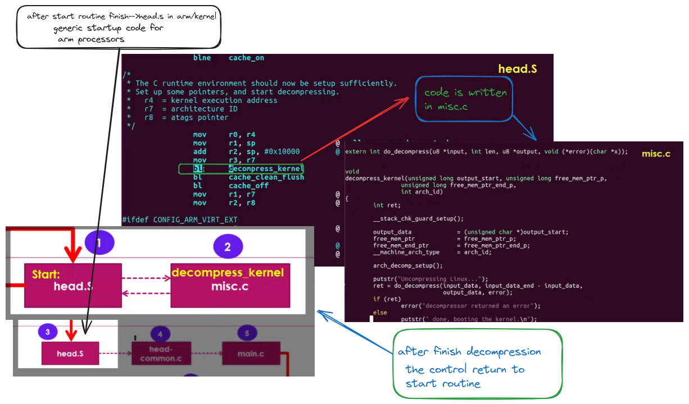
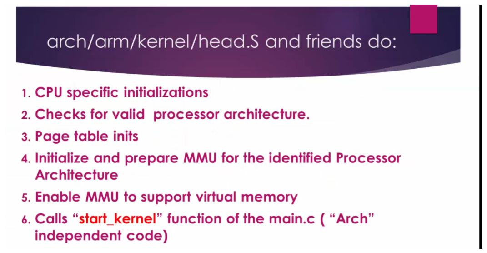
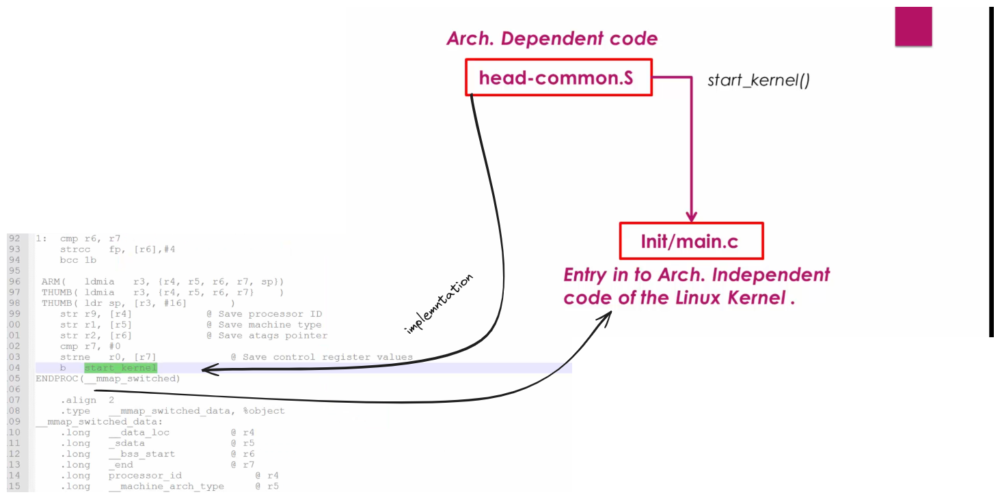
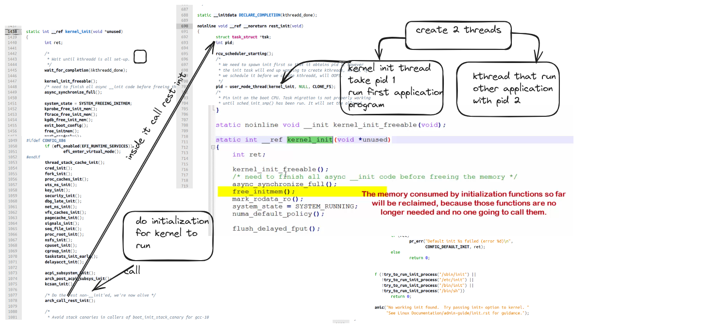

# Components Needed to Run Linux on an Embedded Board

## 1. ROM BootLoader (RBL)
- Tiny BootLoader running from the ROM of SOC.
- Tasks:
    - Stack setup.
    - Watchdog timer configuration.
    - Searching memory device bootable interfaces for MLO/SPL.
    - Copying MLO/SPL to internal SRAM of the CHIP.
    - Executing MLO/SPL.
- Major job: load and execute the second bootloader stage (SPL/MLO).

## 2. Second BootLoader Stage: SPL/MLO
- Runs from SRAM.
- Initializes DRAM.
- Loads Third Stage Bootloader.

## 3. Third Stage: U-Boot
- Runs from DRAM.
- Initializes peripherals like I2C, NAND, Flash, Ethernet.
- Loads Linux kernel image from various boot sources (USB, eMMC, SD card, Ethernet).
- Passes boot arguments to the kernel.

### Control Flow During Linux Boot

### How U-Boot Hands Off Control to Kernel

### Implementation of boot_jump_linux() function

### Entrypoint

### Start Routine Implementation

### Decompression and Relocation of Linux Kernel Image

### Generic Startup Loader Code Location in arm/kernel

### From Dependent Code to Independent

### Start_kernel Function to Init Process

---

### Why AM335x ROM Code Cannot Load U-Boot Directly to DDR RAM?
The ROM code cannot load U-Boot directly to DDR RAM because it lacks knowledge about the specific DDR RAM used in the product. Different manufacturers may use different DDR RAM with varying parameters, and the ROM code cannot initialize DDR controllers based on this variability.

### U-Boot Configuration
- U-Boot behavior can be controlled using the `uEnv.txt` file.
- U-Boot looks for `uImage` for the kernel image.
- U-Boot is configured using configuration variables defined in a board-specific header file.

### Additional Notes
- U-Boot supports over 70 standard command sets enabling more than 150 unique commands.
- Decompression and relocation of the Linux kernel image are responsibilities of the bootstrap loader, which is glued to the kernel.
